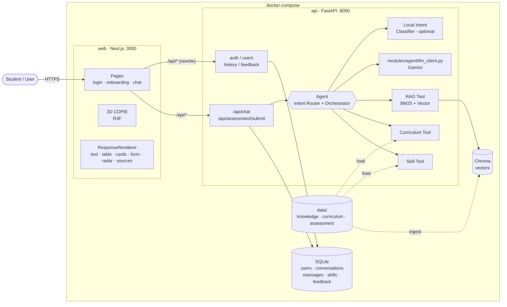

# 00 — Shared Project Context

> ทุกคนต้องอ่านไฟล์นี้ก่อนแผนของตัวเอง · เจ้าของเอกสาร: P1 (Tech Lead) + P3 (Backend Lead)
> อ้างอิงต้นทาง: `resource/RMUTT_CE_AI_Project_Summary_COPIE.md` และ diagram ของอาจารย์ (Docker / Web App / API / AI Router / General AI / University RAG / Local AI Model / Retrieval / LLM Generation / Response-Log / User Data / Knowledge Base / Monitoring / Feedback Loop)

## 1. Product definition

**COPIE** คือ AI Assistant ประจำ **ภาควิชาวิศวกรรมคอมพิวเตอร์ มหาวิทยาลัยเทคโนโลยีราชมงคลธัญบุรี (RMUTT)** ผู้ใช้คุยกับมาสคอต 3D ชื่อ COPIE แทนหน้าแชตธรรมดา แล้ว AI Agent จะเลือกเองว่า

1. คำถามต้องใช้ข้อมูล/Tool ไหน (RAG เอกสารภาค, Curriculum, Skill Assessment, LLM ทั่วไป)
2. ข้อมูลพอหรือยัง ถ้าไม่พอต้องถามกลับอย่างไร
3. ควรแสดงคำตอบเป็น Text, Table, Cards, Form หรือ Radar Chart

**เป้าหมายของ Mini Project (5 วัน, 8 คน):** ระบบ **ทำงานได้จริง ตอบข้อมูลจริงของภาคได้ถูกต้อง และหน้าตาสวย** — ไม่ต้องถึงระดับ production

### กลุ่มผู้ใช้

| `user_type` | ใคร | ตัวอย่างคำถาม |
|---|---|---|
| `prospective` | ผู้สนใจเข้าศึกษา | ภาคคอมเรียนอะไร, แต่ละปีเรียนอะไร, ต้องถนัดอะไร |
| `current_student` + `study_year` 1–4 | นักศึกษาปัจจุบัน | เทอมนี้เรียนอะไร, วิชานี้เกี่ยวกับอะไร, ช่วยวิเคราะห์ skill |
| `near_graduate` | ใกล้จบ | สรุป skill, วิชาที่ผ่านมาเกี่ยวกับสายไหน |

## 2. MVP scope และ non-goals

### สิ่งที่ต้องมีใน Demo (Definition of Done ระดับทีม)

1. Google Sign-In → Onboarding (ชื่อ, ช่วงอายุ, สถานะ, ชั้นปี) → หน้า COPIE
2. ถามข้อมูลภาค → Agent ใช้ RAG → ตอบพร้อม **แหล่งอ้างอิงจริง**
3. ถาม "ปี 2 เทอม 1 เรียนอะไร" → Agent ใช้ Curriculum Tool → **ตาราง** รายวิชา/หน่วยกิตที่ตรงเล่มหลักสูตร
4. ถาม "วิเคราะห์ skill ของผม" → ไม่มีข้อมูล → **ฟอร์มประเมิน** → คำนวณด้วยสูตร → **Radar Chart**
5. เปิดประวัติบทสนทนาเก่าและคุยต่อได้
6. กด 👍/👎 (พร้อมเหตุผล) แล้วถูกบันทึก
7. COPIE มี animation ตามสถานะ idle / listening / thinking / responding / success
8. `docker compose up --build` รันทั้งระบบได้ในคำสั่งเดียว

Optional: Suggested questions, Copy/Export, Local intent classifier, Stats

### Non-goals (ไม่ทำใน 5 วัน)

- file upload, voice, admin panel, multi-agent, streaming token-by-token (ใช้ typing animation ฝั่ง frontend แทน)
- Career / Learning Roadmap แบบเต็ม
- Postgres, migration tool, Redis, Keycloak, monitoring stack, deploy cloud — ใช้ SQLite + docker-compose ในเครื่อง
- โมเดล 3D ละเอียดจาก Blender (สร้าง COPIE จาก primitive ใน R3F; GLB เป็น stretch)
- ระบบ refresh token / role / permission — มี user ประเภทเดียวคือผู้ใช้ทั่วไป

## 3. UI / UX source of truth

```text
┌──────────────────────────────────────────────────────────────┐
│ ☰ COPIE · CE RMUTT                          [avatar ▾]       │
├───────────┬──────────────────────────────────────────────────┤
│ History   │              [ 3D COPIE mascot ]                 │
│ sidebar   │          "วันนี้อยากให้ช่วยเรื่องอะไร?"              │
│ (P2)      │                                                  │
│ + New     │   ┌── Response panel (P6 Renderer) ───────────┐  │
│ • ปี 3... │   │ Text / Table / Cards / Form / Radar       │  │
│ • Skill.. │   │ Sources · Action chips · 👍👎 · Copy       │  │
│           │   └───────────────────────────────────────────┘  │
│           │   [ Suggested prompts (P7) ]                     │
│           │   ┌───────────────────────────────────────┐ ➤    │
│           │   │ Ask about Computer Engineering...     │      │
│           │   └───────────────────────────────────────┘      │
└───────────┴──────────────────────────────────────────────────┘
Mobile: sidebar เป็น drawer, COPIE ย่อด้านบน, response เต็มจอ
```

| Route | เจ้าของ | หน้าที่ |
|---|---|---|
| `/` | P1 | redirect: ไม่ login → `/login`, ยังไม่ onboard → `/onboarding`, อื่นๆ → `/chat` |
| `/login` | P2 | ปุ่ม Continue with Google (+ Dev Login เมื่อ `DEV_AUTH=true`) |
| `/onboarding` | P2 | ฟอร์ม 4 ข้อ |
| `/chat` | P1 | Main AI Experience (COPIE + Renderer + History + Suggestions) |
| `/dev` | P6 | Playground แสดง mock ทุก `response_type` (ใช้ตอนพัฒนา) |

### Design tokens (P1 ปรับได้ แต่ต้องประกาศใน Day 1)

```text
copie-teal     #0E9AA7   สีหลัก / ตาเรืองแสงของ COPIE
deep-navy      #13233A   หัวข้อ / พื้นหลังฉาก 3D
mist           #EEF4F7   พื้นหลังแอป
surface        #FFFFFF   การ์ด
ink            #1B2733   ข้อความหลัก
muted          #5F6F80   ข้อความรอง
success        #1F9D6B   skill/success state
warning        #D98E04   ข้อมูลไม่พบ / ถามกลับ
danger         #D0475E   error
font           IBM Plex Sans Thai / Noto Sans Thai (ข้อความ), Bai Jamjuree (หัวข้อ)
```

- UI ภาษาไทยเป็นหลัก ศัพท์เทคนิคใช้อังกฤษได้
- ทุกคำตอบจาก RAG ต้องมีแหล่งอ้างอิงที่กดเปิดได้
- ต้องรองรับ 1440 / 1024 / 390 px และ `prefers-reduced-motion`

## 4. Architecture decisions (ทำไมง่ายที่สุด)

| ตัดสินใจ | เลือก | เหตุผล (ทำไมง่ายที่สุด) |
|---|---|---|
| Repo | **Monorepo 1 repo** | ทุกคนเห็นทุกอย่าง, PR เดียวแก้ contract ได้ทั้ง 2 ฝั่ง |
| Backend | **FastAPI ตัวเดียว** (ไม่แยก microservice) | RAG/ML ต้องใช้ Python อยู่แล้ว, Agent + Tools เรียกกันเป็น function call ธรรมดา ไม่ต้องทำ HTTP ภายใน |
| Database | **SQLite** (ผ่าน SQLModel) | เป็นไฟล์เดียว ไม่ต้องตั้ง server, พอสำหรับ demo |
| Vector DB | **Chroma (embedded, persistent folder)** | ไม่ต้องรัน server แยก |
| Auth | **Google ID Token → Backend verify → JWT ของเราเอง** | ไม่ต้องใช้ NextAuth / Supabase, มี **Dev Login** ให้ทีมเทสได้โดยไม่ต้องตั้ง OAuth |
| LLM | **Gemini API** (ผ่าน `modules/agent/llm_client.py` ตัวเดียว) | Free tier, รองรับ JSON output; เปลี่ยน provider ได้ที่ไฟล์เดียว |
| Agent | **Router 1 LLM call (JSON) → Python dispatch → Generator 1 LLM call** | ไม่ใช้ framework agent ที่ซับซ้อน, debug ง่าย, มี rule-based fallback ถ้า LLM ล่ม |
| Frontend ↔ Backend | **Next.js rewrites `/api/*` → FastAPI** | ไม่ต้องยุ่ง CORS, frontend เรียก `/api/...` เหมือนอยู่ที่เดียวกัน |
| 3D | **React Three Fiber สร้าง COPIE จาก primitive** (กล่อง/ทรงกลม) | ไม่ต้องปั้นโมเดลใน Blender, animate ด้วย `useFrame` ได้ทันที (GLB เป็น stretch) |
| Run | **docker-compose 2 services** (`web`, `api`) | ตรงกับ diagram, คำสั่งเดียวรันทั้งระบบตอน Demo |

---

## 5. System overview



### Mapping กับ Diagram ของอาจารย์

| กล่องใน Diagram | ใน COPIE | เจ้าของ |
|---|---|---|
| Web App (Frontend) | `frontend/` Next.js + 3D COPIE + Renderer | P1, P6, P2, P7, P8 |
| API / Backend | `backend/app/main.py` + router ของแต่ละ module ใน `backend/app/modules/*` | P3, P2 |
| AI Router / Agent | `backend/app/modules/agent/` | P3 |
| General AI (Gemini) | `backend/app/modules/agent/llm_client.py` | P3 |
| University RAG | `backend/app/modules/rag/` | P4 |
| Local AI Model | `backend/app/modules/intent_ml/` (TF-IDF + LogisticRegression) | P7 |
| Retrieval / Knowledge (BM25 + Vector + Hybrid) | `modules/rag/retriever.py` | P4 |
| LLM Generation (context + citation + safety) | `agent/generator.py` | P3 (prompt ร่วมกับ P4) |
| Response / Log | `services/history_service.py` + `messages` table | P2 |
| User Data / Context | `users`, `skill_profiles` tables | P2 |
| Knowledge Base | `data/knowledge/*.md`, `data/curriculum/curriculum.json` | P4, P5 |
| Monitoring & Analytics | `messages.intent/latency_ms` + `feedback` + `GET /api/stats` | P2 (+P8 eval report) |
| Feedback Loop | 👍/👎 + History continue | P2 |

---

## 6. Request flows

### 6.1 Login

```text
[Login page] ปุ่ม Google (@react-oauth/google) → ได้ id_token
   → POST /api/auth/google {id_token}
   → backend verify (google-auth) → upsert user → ออก JWT
   ← {access_token, user, is_new_user}
[frontend] เก็บ token ใน localStorage
   → user.onboarded == false ? /onboarding : /chat
```
Dev mode (`DEV_AUTH=true`): `POST /api/auth/dev {email, name}` → ได้ JWT ทันที (ใช้เทส / ใช้ตอน Google OAuth ยังไม่พร้อม)

### 6.2 Chat (หัวใจของระบบ)

```text
POST /api/chat {conversation_id | null, message}
 1. ctx   = user_service.get_user_context(user)            # profile + skill ล่าสุด  (P2)
 2. conv  = history_service.get_or_create_conversation(...) ; save user message (P2)
 3. route = intent_router.route(message, ctx, recent_messages)                     (P3)
      a) USE_LOCAL_INTENT และ confidence ≥ 0.80 → ใช้ intent จาก ML (P7)
      b) ไม่งั้น → LLM Router (JSON) → {intent, year, semester, course_query, search_query}
      c) LLM error/timeout → rule_router (regex: "ปี 2", "เทอม 1", "skill", รหัสวิชา)
 4. เติมข้อมูลที่ขาด (Missing-info detection)
      curriculum ไม่มี year → ใช้ ctx.study_year → ยังไม่มี → ถามกลับ (text + actions ปุ่ม "ปี 1 เทอม 1" ...)
 5. dispatch ตาม intent
      department_info → rag.search_department_knowledge → generator (อ้างอิง [1][2]) → text + sources
      curriculum      → curriculum.get_courses(year, semester)                   → course_table
      course_detail   → curriculum.get_course_detail(query) (+ RAG เสริม)         → cards
      skill_analysis  → skill ยังไม่มี → skill.get_assessment()                   → assessment_form
                        มีแล้ว → generator อธิบายผล                                → skill_radar
      general         → generator (persona COPIE, จำกัดขอบเขตเรื่องภาค CE)        → text
 6. สร้าง AgentResponse → history_service.add_assistant_message → return
```

### 6.3 Multi-step Skill Flow

```text
User: "ช่วยวิเคราะห์ Skill ของผม"
  → Agent: skill = None → response_type = assessment_form (12 ข้อ)
User กรอกฟอร์ม → POST /api/assessment/submit {conversation_id, assessment_id, answers}
  → skill.calculate_skill(answers)          (P5, สูตรคำนวณ — LLM ไม่ได้ให้คะแนน)
  → skill_store.save_skill_profile(...)     (P2)
  → generator อธิบายผล                       (P3)
  ← response_type = skill_radar  → COPIE state = success
ครั้งต่อไปถาม "Skill ผมเป็นยังไง" → มี profile แล้ว → skill_radar ทันที
```

### 6.4 สถานะของ COPIE (Frontend เป็นคนคุม ไม่อยู่ใน API)

| Event | State |
|---|---|
| เปิดหน้า / ว่าง | `idle` |
| ผู้ใช้กำลังพิมพ์ | `listening` |
| ส่งคำถาม รอ API | `thinking` |
| ได้คำตอบ (2.5 วินาที) | `responding` |
| ได้ `skill_radar` หรือส่งฟอร์มสำเร็จ | `success` → กลับ `idle` |
| API error | `idle` + toast |

---

## 7. Technology decisions (lock แล้ว)

| ส่วน | Library | หมายเหตุ |
|---|---|---|
| Runtime | **Node.js 22 LTS** (Next 16 ต้องการ ≥ 20.9) | ทุกคนใช้เวอร์ชันเดียวกัน · ใส่ `"engines"` ใน `package.json` |
| Frontend | **`next@16`** (16.3.x), **`react@19`**, `typescript@5`, **`tailwindcss@4`**, `eslint@9` | App Router, Turbopack (ค่าเริ่มต้นของ Next 16) |
| 3D | `three`, `@react-three/fiber@9`, `@react-three/drei@10` | COPIE จาก primitive + `Float`, `ContactShadows`, `Environment` (fiber v9 = รุ่นสำหรับ React 19) |
| Animation | `motion` (ชื่อใหม่ของ Framer Motion, `import { motion } from "motion/react"`) | การ์ด/ตาราง เลื่อนเข้า |
| Chart | `recharts` (RadarChart) | Skill Radar |
| State | `zustand` | เบาที่สุด |
| Markdown | `react-markdown` + `remark-gfm` | TextResponse |
| Icons | `lucide-react` | ชื่อไอคอนใน `InfoCard.icon` |
| Google Login | `@react-oauth/google` | ได้ `credential` (id_token) |
| Backend | `fastapi`, `uvicorn[standard]`, `sqlmodel`, `pyjwt`, `google-auth`, `python-dotenv`, `requests` | |
| LLM | `google-genai` | ตั้ง `LLM_MODEL` ใน `.env` (ใช้รุ่น Flash เพื่อความเร็ว) |
| RAG | `sentence-transformers` (`intfloat/multilingual-e5-small`), `chromadb`, `rank-bm25`, `pythainlp` | e5 ต้องใส่ prefix `query: ` / `passage: ` |
| Fuzzy | `rapidfuzz` | ค้นชื่อวิชา |
| ML | `scikit-learn`, `joblib` | TF-IDF (char n-gram) + LogisticRegression |
| Test | `pytest`, `httpx` | |

### เวอร์ชันและการ pin

- Day 1 P1 สร้างโปรเจกต์ด้วย `npx create-next-app@latest ... --no-agents-md` (คำสั่งเต็มใน `01_FRONTEND_CORE_3D_MASCOT.md` Phase 0) → ได้ **Next.js 16.x ล่าสุด** (ตรวจเมื่อ 2026-09-24: next 16.3.6, react 19.2.8, tailwindcss 4.x)
- บันทึกเวอร์ชันที่ได้ลง `frontend/package.json` และ **commit `package-lock.json`** — ทุกคนติดตั้งด้วย `npm ci` เพื่อให้ได้เวอร์ชันเดียวกัน
- **ห้ามอัปเกรด major version ระหว่าง 5 วัน** (patch/minor ได้ผ่าน PR ของ P1)
- Backend pin เวอร์ชันใน `requirements.txt` ด้วย `==` ตั้งแต่ Day 1 (P3)

### สิ่งที่ต่างจาก Next.js รุ่นเก่า (ตัวอย่างในเน็ตหลายอันยังเป็น Next 13–15)

| เรื่อง | Next.js 16 + Tailwind 4 |
|---|---|
| Tailwind config | **ไม่มี `tailwind.config.ts`** — ใส่ token ใน `globals.css` ด้วย `@import "tailwindcss";` + `@theme { --color-copie-teal: #0E9AA7; ... }` แล้วใช้ `bg-copie-teal` ได้ทันที |
| PostCSS | `postcss.config.mjs` ใช้ plugin `@tailwindcss/postcss` (create-next-app ตั้งให้) |
| Config | `next.config.ts` (TypeScript) — rewrites `/api/:path*` เหมือนเดิม |
| Bundler | Turbopack เป็นค่าเริ่มต้นทั้ง `dev` และ `build` |
| Lint | ไม่มีคำสั่ง `next lint` แล้ว — `npm run lint` เรียก `eslint` ตรงๆ |
| Middleware | ไฟล์ `middleware.ts` เปลี่ยนชื่อเป็น **`proxy.ts`** (เราไม่ใช้ — ตรวจ login ฝั่ง client ด้วย `AuthGuard`) |
| Dynamic params | `params` / `searchParams` ใน page เป็น **Promise** ต้อง `await` (หรือ `use()` ใน client component) |
| React 19 | ไม่ต้องใช้ `forwardRef` แล้ว (ส่ง `ref` เป็น prop ได้), มี `useActionState`, `use()` |

ถ้าใช้ AI ช่วยเขียน ให้บอกเสมอว่า **"Next.js 16 App Router + React 19 + Tailwind CSS v4"** ไม่งั้นมักได้โค้ดแบบรุ่นเก่า

---

## 8. Repository structure และ ownership

> 👤 = เจ้าของ (CODEOWNER) — คนอื่นแก้ได้ต้องได้ approve จากเจ้าของ · 🔒 = LOCKED · 🤝 = แก้ร่วมกันได้ผ่าน PR

```text
COPIE/
├── README.md                              👤 P8 (setup + demo script) 🤝 P1
├── .env.example                           👤 P3
├── docker-compose.yml                     👤 P3 (Day 4)
├── .gitignore, .gitattributes             👤 P1
├── .githooks/                             👤 P1  (pre-commit, commit-msg, pre-push)
├── .github/                               👤 P1  (CODEOWNERS, PR template) · workflows/ci.yml 👤 P3
├── scripts/
│   ├── check-ai-watermark.sh              👤 P1
│   └── eval/                              👤 P8
├── IMPLEMENTATION_PLANS/                  🤝 ทุกคน (ผ่าน docs/* PR)
├── docs/handoffs/, docs/acceptance/       🤝 รายงานจบงาน + ผลตรวจรับ
├── resource/                              เอกสารโจทย์ต้นทาง
│
├── data/
│   ├── knowledge/                         👤 P4
│   ├── curriculum/                        👤 P5
│   ├── assessment/                        👤 P5
│   └── eval/                              👤 P8
│
├── frontend/                              Next.js 16 · React 19 · Tailwind v4 — แอปเดียว
│   ├── package.json, next.config.ts, eslint.config.mjs, ...   👤 P1
│   └── src/
│       ├── app/                           routes บางๆ — logic อยู่ใน modules
│       │   ├── layout.tsx, page.tsx, globals.css, chat/   👤 P1
│       │   ├── login/, onboarding/        👤 P2
│       │   └── dev/                       👤 P6
│       ├── types/contract.ts              🔒 P1 + P3
│       └── modules/
│           ├── core/                      👤 P1  ui/, workspace/, api.ts, chatStore.ts
│           ├── mascot/                    👤 P1  3D COPIE
│           ├── user/                      👤 P2  auth/, onboarding/, history/, feedback/, userStore.ts
│           ├── renderer/                  👤 P6  ResponseRenderer, components/, mock/, DevPlayground
│           ├── suggest/                   👤 P7  suggested prompts
│           └── export/                    👤 P8  copy / export
│
└── backend/                               FastAPI — แอปเดียว process เดียว
    ├── requirements.txt, pytest.ini, Dockerfile   👤 P3
    ├── storage/                           (gitignored: app.db, chroma/)
    └── app/
        ├── main.py, core/                 👤 P3  entry point + config
        ├── schemas/contract.py            🔒 P1 + P3
        └── modules/
            ├── user/                      👤 P2  database, models, auth/, services/, routers/, tests/
            ├── agent/                     👤 P3  router, orchestrator, intent/rule router, generator, llm_client, tests/
            ├── rag/                       👤 P4  chunker, ingest, retriever, service, tests/
            ├── tools/                     👤 P5  curriculum/, skill/, tests/
            └── intent_ml/                 👤 P7  train, predict, model.joblib, tests/
```

**หนึ่งระบบ แบ่งโฟลเดอร์ตาม module:** frontend เป็น Next.js แอปเดียว, backend เป็น FastAPI แอปเดียว — module ไม่ได้รันแยก แค่แบ่งโฟลเดอร์ตามเจ้าของ ชื่อ module ตรงกับ branch prefix (ยกเว้น `intent_ml` ที่ใช้ `intent-ml/`, และ `qa/` ของ P8 ที่อยู่ใน `data/eval` + `scripts/eval`) แต่ละ module มี `README.md` บอกหน้าที่และ public API

---

### Ownership rules

- เจ้าของแก้ไฟล์ในโฟลเดอร์ตัวเองได้ผ่าน PR ปกติ (review 1 คน)
- 🔒 ไฟล์ contract, `docker-compose.yml`, `requirements.txt`, `package.json`, `.env.example`, CI เป็น **shared surface** — แก้ได้แต่ต้องให้เจ้าของ (P1/P3) approve
- ห้ามอ่าน/เขียนตารางของคนอื่นตรงๆ — เรียกผ่าน function ที่ `app.modules.user` export เท่านั้น
- เรียกข้าม module ผ่าน public API เท่านั้น: frontend `@/modules/<name>` (ESLint บังคับ), backend `app.modules.<name>` (`__init__.py`)
- ห้ามแก้ไฟล์ของคนอื่นเพื่อ "ให้ของตัวเองทำงาน" — เปิด Issue หรือทักเจ้าของ

## 9. Environment variables (`.env.example`)

```bash
# ---- backend ----
JWT_SECRET=change-me
GOOGLE_CLIENT_ID=xxxxxxxx.apps.googleusercontent.com
DEV_AUTH=true                     # เปิด /api/auth/dev (ปิดตอน demo จริงได้)
GEMINI_API_KEY=
LLM_MODEL=                        # ชื่อรุ่น Gemini Flash ที่ทีมใช้
LLM_TIMEOUT_S=20
DATABASE_URL=sqlite:///./storage/app.db
CHROMA_DIR=./storage/chroma
EMBEDDING_MODEL=intfloat/multilingual-e5-small
RAG_MIN_SCORE=0.35                # ต่ำกว่านี้ = "ไม่พบข้อมูลในเอกสารของภาค"
USE_LOCAL_INTENT=false

# ---- frontend ----
NEXT_PUBLIC_GOOGLE_CLIENT_ID=xxxxxxxx.apps.googleusercontent.com
API_URL=http://localhost:8000     # ปลายทางของ rewrite /api/* (ใน docker = http://api:8000, ต้องตั้งตอน build)
```

---

## 10. วิธีรันในเครื่อง

```bash
# Backend
cd backend
python -m venv .venv && source .venv/Scripts/activate   # Windows Git Bash
pip install -r requirements.txt
python -m app.modules.rag.ingest                          # สร้าง vector index จาก data/knowledge
uvicorn app.main:app --reload --port 8000

# Frontend
cd frontend
npm install
npm run dev                                             # http://localhost:3000

# ทั้งระบบ (Day 4 เป็นต้นไป)
docker compose up --build
```

---

## 11. หลัก "ทำงานได้จริง แต่ไม่ต้อง production"

| เรื่อง | สิ่งที่ต้องทำ | สิ่งที่ไม่ต้องทำ |
|---|---|---|
| ข้อมูล | ข้อมูลภาค/หลักสูตรต้อง **จริง** และมี `source_url` | ไม่ต้องมีระบบ admin แก้ข้อมูล |
| Mock | ใช้ mock/stub ได้ **ระหว่างพัฒนา (Day 1–3)** เพื่อไม่ต้องรอกัน | หลัง M3 (Day 3) ห้ามมี mock ใน flow จริง — mock เหลือได้แค่ใน `/dev` และ tests |
| LLM | ห้ามให้ LLM แต่งรายวิชา/หน่วยกิต/คะแนน skill | ไม่ต้องทำ guardrail ซับซ้อน — system prompt + จำกัดขอบเขตพอ |
| Error | ทุกจุดที่พังได้ต้องมีข้อความบอกผู้ใช้ (ไม่ใช่หน้าขาว) | ไม่ต้องมี retry queue / circuit breaker |
| Test | test สำคัญของ logic ตัวเอง + Demo checklist | ไม่ต้อง coverage สูง, ไม่ต้อง visual regression |
| Security | ไม่ commit secret, ตรวจ JWT, user เห็นเฉพาะข้อมูลตัวเอง | ไม่ต้อง rate limit, refresh token, audit log |
| Docker | `docker compose up --build` ต้องขึ้นทั้งระบบ | ไม่ต้อง multi-stage optimize, healthcheck ซับซ้อน, image scan |

## 12. Team-level acceptance

ระบบถือว่าเสร็จเมื่อผ่าน Demo scenario ทั้ง 6 ใน `09_INTEGRATION_ACCEPTANCE_RUNBOOK.md` บน branch `main` ด้วย `docker compose up --build` จากเครื่องที่ clone ใหม่ และทุกคนส่ง Completion Report (`10_WORK_COMPLETION_REPORT_TEMPLATE.md`) แล้ว
