# 00 — Timeline, Gantt Chart และจุดอัปเดตงาน

> **ฉบับ interactive:** https://claude.ai/artifact/VRzsLp29CpGikCeSu6trTx หรือเปิด [gantt.html](gantt.html) ในเบราว์เซอร์ (กดแถบงานเพื่อดู branch/ชั่วโมง, กดชื่อคนเพื่อดูเฉพาะงานของคนนั้น, เลือก "วันนี้คือ Day N" เพื่อไฮไลต์คอลัมน์)
> รายละเอียดงานแต่ละช่อง: แผนรายคน `01_…` – `08_…` (หัวข้อ Implementation steps) · กติกาการสื่อสาร: `00_GIT_DELIVERY_RULES.md` §13

---

## 1. โครงของ 5 วัน

| วัน | Phase | เป้าหมายของวัน | Milestone |
|---|---|---|---|
| **Day 1** | Setup + Contract | Kickoff, Freeze Contract, repo/skeleton รันได้, stub ของทุกคนเข้า develop | M0 12:00 · M1 17:00 |
| **Day 2** | Build | ทุก module ทำงานเดี่ยวได้ด้วย mock | M2 21:00 |
| **Day 3** | Build + Wire | Agent ใช้ Tool จริง, Frontend เรียก API จริง, Renderer ครบ | M3 21:00 |
| **Day 4** | **Integration** (เผื่อไว้ทั้งวัน) | Demo 1–6 ผ่านบน develop, QA 2 รอบ, Feature Freeze | M4 18:00 |
| **Day 5** | **Bug fix + Polish + Demo** (เผื่อไว้ทั้งวัน) | แก้ P0/P1, Code Freeze, Release, ซ้อม Demo | Code Freeze 15:00 · M5 16:00 |

> งานสร้างทั้งหมดอัดไว้ใน Day 1–3 เพื่อให้เหลือ **2 วันเต็ม** สำหรับรวมระบบและแก้บั๊ก

---

## 2. จังหวะประจำวัน (ใครต้องอัปเดตตอนไหน)

| เวลา | กิจกรรม | ใคร | ต้องส่งอะไร |
|---|---|---|---|
| 09:00 | Daily Stand-up (15 นาที) | ทุกคน | เมื่อวานเสร็จอะไร / วันนี้จะ merge อะไร / ติดอะไร |
| 09:30–12:30 | AM block | ทุกคน | ทำงานบน branch ตัวเอง |
| 13:00 | Midday Status | ทุกคน | 1 บรรทัดใน `#status` + 🟢🟡🔴 |
| 13:30–17:00 | PM block | ทุกคน | ติดเกิน 1 ชม. → `#blockers` ทันที |
| **17:00** | **PR Cutoff** | ทุกคน | push + เปิด PR เข้า `develop` (Draft ได้) |
| 17:00–19:00 | Review & Merge | P1 (FE), P3 (BE) + reviewer | Approve / ขอแก้ภายใน 2 ชม. |
| 19:00 | Smoke test develop | P8 (Day 3–5) | ผล checklist ใน `#status` |
| **21:00** | **Daily Report** | ทุกคน | ✅ เสร็จ / 🔨 กำลังทำ / ⛔ ติด / 📌 พรุ่งนี้ |

**จุดอัปเดตพิเศษ**
- **Day 1 11:00** — ทุกคนบอกว่า "stub ของฉันจะ merge ก่อน 17:00" (P2, P4, P5 ต้องมี stub function ให้ P3)
- **Day 2 12:00** — P8 ส่ง eval set ให้ P7
- **Day 3 13:00** — P3 ประกาศว่าเริ่มสลับ stub → Tool จริง (P4/P5 ต้อง merge แล้ว)
- **Day 4 11:00 / 16:00** — P8 QA รอบ 1 / 2 → เปิด GitHub Issues → เจ้าของ module รับ Issue ภายใน 30 นาที
- **Day 5 14:30** — P1 ถามรอบสุดท้ายว่ามี P0 ค้างไหม ก่อน Code Freeze 15:00

---

## 3. Gantt Chart

> แกนเวลาแสดงเป็น Day 1–5 (วันที่ในโค้ดเป็นค่าสมมติ ไม่ต้องแก้) · ช่วงเย็น 17:00–21:00 ของทุกวัน = PR/Review ไม่แสดงใน chart

```mermaid
gantt
    title COPIE 5-Day Sprint
    dateFormat YYYY-MM-DD HH:mm
    axisFormat Day %e
    tickInterval 1day

    section Milestones
    M0 Contract Freeze      :milestone, m0, 2026-01-01 12:00, 0m
    M1 Skeleton             :milestone, m1, 2026-01-01 17:00, 0m
    M2 Standalone           :milestone, m2, 2026-01-02 21:00, 0m
    M3 Core Wired           :milestone, m3, 2026-01-03 21:00, 0m
    M4 Feature Freeze       :milestone, m4, 2026-01-04 18:00, 0m
    Code Freeze             :milestone, cf, 2026-01-05 15:00, 0m
    M5 Release v1.0         :milestone, m5, 2026-01-05 16:00, 0m

    section P1 Lead·FE·3D
    Kickoff·Repo·App shell      :p1a, 2026-01-01 09:00, 3h30m
    Design system·api.ts        :p1b, 2026-01-01 13:30, 3h30m
    COPIE model R3F             :p1c, 2026-01-02 09:30, 3h
    COPIE 5 states              :p1d, 2026-01-02 13:30, 3h30m
    Workspace UI                :p1e, 2026-01-03 09:30, 3h
    Wire API + Renderer         :p1f, 2026-01-03 13:30, 3h30m
    Integration lead·E2E        :crit, p1g, 2026-01-04 09:30, 3h
    Responsive·states           :p1h, 2026-01-04 13:30, 3h30m
    Polish UI                   :p1i, 2026-01-05 09:30, 3h
    Release·ซ้อม Demo            :crit, p1j, 2026-01-05 13:30, 3h30m

    section P2 User system
    Kickoff                     :p2a, 2026-01-01 09:00, 2h
    DB·JWT·Dev login·stubs      :p2b, 2026-01-01 13:30, 3h30m
    Google login + Profile API  :p2c, 2026-01-02 09:30, 3h
    Login + Onboarding UI       :p2d, 2026-01-02 13:30, 3h30m
    History service + API       :p2e, 2026-01-03 09:30, 3h
    History sidebar             :p2f, 2026-01-03 13:30, 3h30m
    Feedback API + UI           :p2g, 2026-01-04 09:30, 3h
    Stats·E2E Demo 1 5 6        :p2h, 2026-01-04 13:30, 3h30m
    Bug fix P0 P1               :crit, p2i, 2026-01-05 09:30, 7h30m

    section P3 Agent·Backend
    Kickoff·FastAPI·contract.py :p3a, 2026-01-01 09:00, 3h30m
    LLM client·rule router·CI   :p3b, 2026-01-01 13:30, 3h30m
    LLM intent router           :p3c, 2026-01-02 09:30, 3h
    Orchestrator with stubs     :p3d, 2026-01-02 13:30, 3h30m
    Real tools·generator        :crit, p3e, 2026-01-03 09:30, 3h
    Skill flow·user context     :p3f, 2026-01-03 13:30, 3h30m
    Docker·error handling       :p3g, 2026-01-04 09:30, 3h
    Local intent·prompt tuning  :p3h, 2026-01-04 13:30, 3h30m
    Tuning·latency·bug fix      :crit, p3i, 2026-01-05 09:30, 7h30m

    section P4 RAG
    Kickoff·เก็บเอกสาร           :p4a, 2026-01-01 09:00, 3h30m
    Clean 8 md·stub             :p4b, 2026-01-01 13:30, 3h30m
    Chunk·embed·Chroma          :p4c, 2026-01-02 09:30, 3h
    Vector retriever·12 docs    :p4d, 2026-01-02 13:30, 3h30m
    BM25 + RRF hybrid           :p4e, 2026-01-03 09:30, 3h
    RAG prompt·test 20Q         :p4f, 2026-01-03 13:30, 3h30m
    Tuning ตามผล eval            :p4g, 2026-01-04 09:30, 7h30m
    Knowledge fix               :p4h, 2026-01-05 09:30, 7h30m

    section P5 Curriculum·Skill
    Kickoff·หาเล่มหลักสูตร        :p5a, 2026-01-01 09:00, 3h30m
    Curriculum Y1-2·stubs       :p5b, 2026-01-01 13:30, 3h30m
    Y3-4·validate               :p5c, 2026-01-02 09:30, 3h
    Curriculum service          :p5d, 2026-01-02 13:30, 3h30m
    Skill questions·formula     :p5e, 2026-01-03 09:30, 3h
    Scoring·tests               :p5f, 2026-01-03 13:30, 3h30m
    Integration test via chat   :p5g, 2026-01-04 09:30, 7h30m
    Data verify·fix             :p5h, 2026-01-05 09:30, 7h30m

    section P6 Renderer
    Kickoff·review contract     :p6a, 2026-01-01 09:00, 2h
    Mocks·Renderer core·dev     :p6b, 2026-01-01 13:30, 3h30m
    Text + Sources              :p6c, 2026-01-02 09:30, 3h
    CourseTable + Cards         :p6d, 2026-01-02 13:30, 3h30m
    AssessmentForm              :p6e, 2026-01-03 09:30, 3h
    SkillRadar·ActionChips      :p6f, 2026-01-03 13:30, 3h30m
    Animation·in Workspace      :p6g, 2026-01-04 09:30, 3h
    Error state·responsive      :p6h, 2026-01-04 13:30, 3h30m
    Polish·bug fix              :p6i, 2026-01-05 09:30, 7h30m

    section P7 Suggest·ML
    Kickoff                     :p7a, 2026-01-01 09:00, 2h
    Suggested prompts           :p7b, 2026-01-01 13:30, 3h30m
    Prompts to Workspace        :p7c, 2026-01-02 09:30, 3h
    Intent dataset              :p7d, 2026-01-02 13:30, 3h30m
    Train TF-IDF + LR           :p7e, 2026-01-03 09:30, 3h
    predict_intent·report       :p7f, 2026-01-03 13:30, 3h30m
    Router integration·ML vs LLM :p7g, 2026-01-04 09:30, 7h30m
    QA support·ML slides        :p7h, 2026-01-05 09:30, 7h30m

    section P8 Export·QA
    Kickoff                     :p8a, 2026-01-01 09:00, 2h
    Eval set 60 ข้อ              :p8b, 2026-01-01 13:30, 3h30m
    CopyButton                  :p8c, 2026-01-02 09:30, 3h
    ExportMenu TXT JSON         :p8d, 2026-01-02 13:30, 3h30m
    run_eval.py                 :p8e, 2026-01-03 09:30, 3h
    Demo checklist·README       :p8f, 2026-01-03 13:30, 3h30m
    QA 11 00 + 16 00·Issues     :crit, p8g, 2026-01-04 09:30, 7h30m
    Regression·README           :p8h, 2026-01-05 09:30, 3h
    Smoke main·จับเวลาซ้อม        :p8i, 2026-01-05 13:30, 3h30m
```

---

## 4. Checkpoint รายคน (ต้อง merge เข้า develop ภายในเวลา)

| คน | M0 · D1 12:00 | M1 · D1 17:00 | M2 · D2 21:00 | M3 · D3 21:00 | M4 · D4 18:00 | M5 · D5 16:00 |
|---|---|---|---|---|---|---|
| P1 | repo + app shell + `contract.ts` | design system, `api.ts` | COPIE 5 states | Workspace ต่อ API จริง + Renderer | responsive, loading/error | `v1.0` บน main |
| P2 | – | DB, JWT, Dev login, stubs | Google login + Onboarding | History service + sidebar | Feedback + stats | (bug fix) |
| P3 | FastAPI + `contract.py` + mock chat | LLM client, rule router, CI | Orchestrator (stubs) | Tool จริง + skill flow | Docker, prompt tuning | (tuning) |
| P4 | – | knowledge 8 ไฟล์ + stub | vector retriever + 12 ไฟล์ | hybrid + prompt + test | tuning ตาม eval | (data fix) |
| P5 | – | curriculum ปี 1–2 + stubs | curriculum service | skill scoring | integration fix | (data fix) |
| P6 | – | mocks + renderer core + `/dev` | text/sources/table/cards | form + radar + chips | animation + responsive | (polish) |
| P7 | – | suggested prompts | dataset + ต่อ workspace | classifier + `predict_intent` | router integration | (QA) |
| P8 | – | eval set 60 ข้อ | copy + export | eval script + checklist | QA report + Issues | smoke test main |

**ถ้าพลาด checkpoint:** แจ้ง 🔴 ใน Daily Report → P1 ตัดสินใจภายในเช้าวันถัดไปว่าจะ (1) ตัด scope (2) ส่งคนช่วย (P7/P8) หรือ (3) ใช้ mock ใน demo

---

## 5. ชั่วโมงงานโดยประมาณ

| | Day 1 | Day 2 | Day 3 | Day 4 | Day 5 | รวม |
|---|---|---|---|---|---|---|
| ทุกคน | 2 (kickoff) + 5 + 1.5 | 6.5 + 1.5 | 6.5 + 1.5 | 6.5 + 1.5 | 6.5 + 1.5 | **~40 ชม./คน** |

- วันละ ~6.5 ชม. ทำงาน (AM 3 + PM 3.5) + ~1.5 ชม. ช่วงเย็นสำหรับ review/แก้ตาม comment
- P7 และ P8 ใช้ชั่วโมงเท่ากัน แต่งานของทั้งคู่ **ถอดออกได้โดย Core ไม่พัง** — ถ้า Core คนไหน 🔴 ให้ P7/P8 ไปช่วยก่อน

---

## 6. Plan B (ถ้าช้ากว่าแผน)

| อาการ | ตัดอะไรก่อน (ตามลำดับ) |
|---|---|
| Day 2 เย็นยังไม่ครบ M2 | BM25 hybrid → ใช้ vector อย่างเดียว · Stats endpoint · Export JSON |
| Day 3 เย็นยังไม่ครบ M3 | Local Intent ML (ใช้ LLM router อย่างเดียว) · COPIE state `listening` · Animation ใน Renderer |
| Google OAuth มีปัญหาวัน Demo | ใช้ Dev Login (ตั้ง `DEV_AUTH=true`) แล้วอธิบายว่าเป็น fallback |
| LLM API ล่ม / quota หมด | rule_router + Tool deterministic ยังตอบ curriculum/skill ได้ · เตรียม API key สำรอง 1 อัน |
