# คำอธิบายภาพหน้าจอ COPIE — White Cyberism

เอกสารนี้อธิบายส่วนต่าง ๆ ของภาพต้นแบบเดสก์ท็อป 16:9 ในชุด `ui-flow-v1` เพื่อให้ทีมออกแบบและพัฒนาเข้าใจหน้าที่ของแต่ละส่วนตรงกัน ภาพเป็นแนวทางการจัดวางและอารมณ์ของ UI ยังไม่ใช่หน้าจอที่กดใช้งานได้จริง

## องค์ประกอบที่ใช้ร่วมกัน

| ส่วน | ความหมายและหน้าที่ |
| --- | --- |
| โลโก้ `COPIE` ซ้ายบน | จุดยึดแบรนด์ ใช้รูปแบบเดียวกันทุกหน้า |
| พื้นขาวและเส้นฟ้าจาง | ภาษาภาพ Cyberism ที่ทำให้หน้าดูเป็นระบบเทคโนโลยี โดยไม่แย่งความเด่นจากเนื้อหา |
| หัวข้อสีดำและเส้นเน้นสีน้ำเงิน | แยกลำดับข้อมูล หัวข้อควรเด่น ส่วนเนื้อหาภาษาไทยต้องอ่านง่าย |
| มาสคอต COPIE | ตัวแทน AI: อยู่กลางจอในสถานะสนทนาและหน้าเริ่มต้น ย่อไปด้านขวาเมื่อผู้ใช้ต้องอ่านข้อมูลหรือกรอกฟอร์ม |
| ไอคอนโปรไฟล์ขวาบน | ทางเข้าข้อมูลบัญชีผู้ใช้หลังเข้าสู่ระบบ ไม่แสดงในหน้า Login |
| ปุ่ม `History` ซ้ายล่าง | เปิดแผงประวัติการสนทนา ใช้ในหน้าสนทนาและหน้าผลลัพธ์; อาจซ่อนระหว่างตอบแบบประเมินเพื่อให้จดจ่อ |
| ช่องพิมพ์ด้านล่าง | ส่งคำถามใหม่หรือถามต่อ แสดงเฉพาะบริบทที่ผู้ใช้สนทนากับ COPIE ได้ |

คำตอบ AI ในภาพไม่ใช่ฟองแชต ข้อความ ตาราง การ์ด แบบฟอร์ม และกราฟเป็นรูปแบบการแสดงผลที่ Agent เลือกตามคำถาม ผู้ใช้ควรเห็นแหล่งอ้างอิงเมื่อคำตอบอาศัยเอกสาร

## 01 — Login

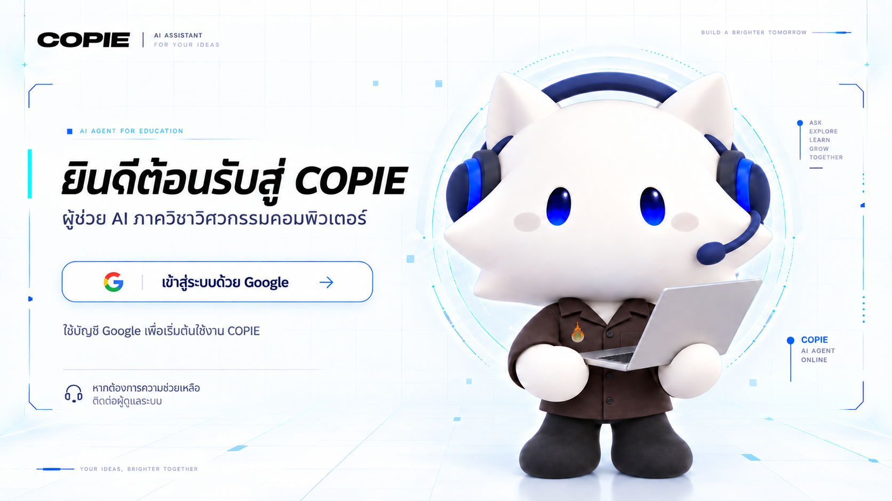

- **ซ้ายบน:** โลโก้ COPIE และคำกำกับ AI Assistant บอกว่าผู้ใช้กำลังเข้าระบบใด
- **พื้นที่ข้อความด้านซ้าย:** ชื่อหน้าต้อนรับและคำอธิบายสั้น ๆ ว่า COPIE เป็นผู้ช่วยของภาควิชาวิศวกรรมคอมพิวเตอร์
- **ปุ่ม Google:** การกระทำหลักของหน้า กดแล้วเริ่มขั้นตอนเข้าสู่ระบบด้วยบัญชี Google
- **ข้อความใต้ปุ่ม:** อธิบายการเริ่มใช้งานและช่องทางขอความช่วยเหลือโดยไม่ระบุอีเมลสมมติ
- **มาสคอตด้านขวา:** สร้างการจดจำแบรนด์ โดยยังเว้นพื้นที่ให้ปุ่มเข้าสู่ระบบเห็นชัด

**เมื่อทำงานจริง:** ผู้ใช้เดิมไปหน้าสนทนา ส่วนผู้ใช้ใหม่ไป Onboarding หน้า Login ไม่แสดงปุ่ม History หรือโปรไฟล์ เพราะยังไม่ได้เข้าสู่ระบบ

## 02 — Onboarding / ข้อมูลผู้ใช้ใหม่

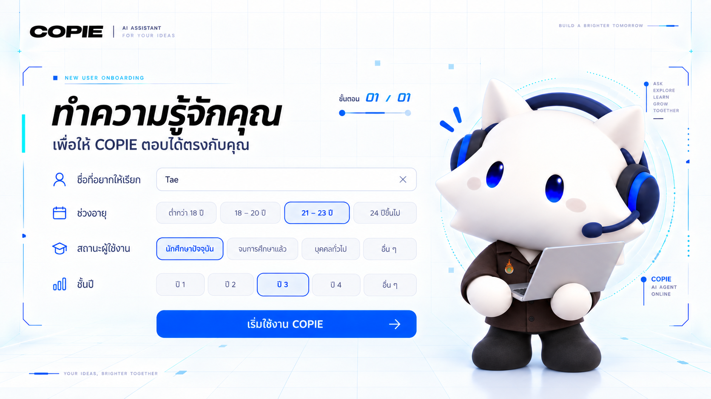

- **หัวข้อและตัวบอกขั้นตอน:** แจ้งว่ากำลังกรอกข้อมูลเพื่อให้คำตอบของ COPIE เหมาะกับผู้ใช้
- **ชื่อที่อยากให้เรียก:** ช่องข้อความสำหรับชื่อที่แสดงในระบบ
- **ช่วงอายุ:** ตัวเลือกแบบเลือกได้หนึ่งค่า ภาพแสดง `21–23 ปี` เป็นตัวอย่างของค่าที่เลือก
- **สถานะผู้ใช้งาน:** แยกผู้สนใจ นักศึกษาปัจจุบัน และกลุ่มอื่น เพื่อใช้เป็นบริบทของคำตอบ
- **ชั้นปี:** แสดงเมื่อเลือกสถานะนักศึกษาปัจจุบัน ภาพใช้ `ปี 3` เป็นตัวอย่าง
- **ปุ่ม `เริ่มใช้งาน COPIE`:** บันทึกข้อมูลและเข้าสู่หน้าสนทนา
- **มาสคอตด้านขวา:** อยู่ร่วมกับฟอร์มโดยไม่ทับช่องกรอก

**เมื่อทำงานจริง:** ต้องตรวจข้อมูลที่จำเป็นก่อนบันทึก และใช้ข้อมูลโปรไฟล์เป็นบริบทให้ Agent ไม่ใช่ผลประเมินทักษะ

## 03 — กำลังพิมพ์คำถาม

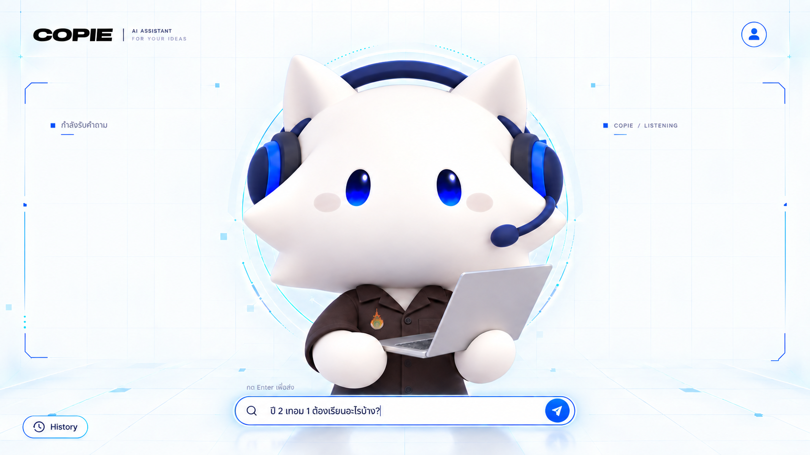

- **มาสคอตกลางจอ:** จุดสนใจหลักในสถานะรอฟังคำถาม (`listening`)
- **พื้นที่ซ้ายและขวาที่ค่อนข้างว่าง:** เตรียมไว้สำหรับคำตอบหลังส่งคำถาม ไม่เติมข้อความตกแต่งจนดูเป็นประวัติแชต
- **สถานะ `COPIE / LISTENING`:** บอกว่าระบบพร้อมรับคำถาม
- **ช่องพิมพ์ที่มีเส้นขอบน้ำเงิน:** แสดงว่าเคอร์เซอร์อยู่ในช่อง ภาพใช้คำถามเรื่องปี 2 เทอม 1 เป็นตัวอย่าง
- **ปุ่มส่งและคำแนะนำ Enter:** ส่งข้อความที่พิมพ์ไปให้ Agent
- **History และโปรไฟล์:** เปิดประวัติหรือบัญชีได้โดยไม่ออกจากหน้าหลัก

**เมื่อทำงานจริง:** หลังส่งคำถาม มาสคอตเปลี่ยนจาก `listening` เป็น `thinking` ระหว่างรอผล แล้วเป็น `responding` เมื่อคำตอบกลับมา

## 04 — AI ตอบกลับในหน้าหลัก

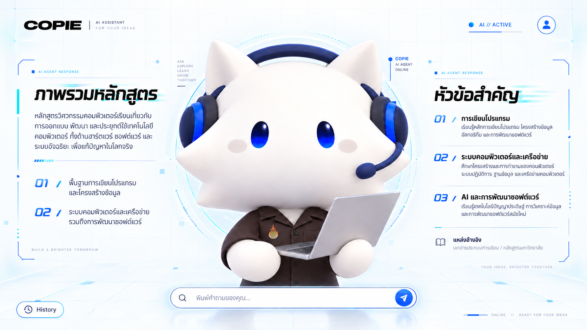

- **มาสคอตขนาดใหญ่ตรงกลาง:** คงความรู้สึกว่าผู้ใช้คุยกับ COPIE โดยตรง
- **คำตอบด้านซ้าย:** แสดงหัวข้อ ภาพรวม และข้อความอธิบายหลัก เป็นตัวอักษรที่ผสานกับพื้นหน้าเว็บ
- **คำตอบด้านขวา:** แสดงประเด็นย่อยเป็นลำดับและส่วนแหล่งอ้างอิง ทั้งสองด้านเป็นคำตอบชุดเดียวกัน
- **เส้นและสัญลักษณ์สีน้ำเงิน:** ช่วยจัดลำดับข้อมูลและสื่อธีม Cyberism ไม่ใช่กรอบฟองแชต
- **ช่องพิมพ์ล่างกลาง:** ใช้ถามต่อในบทสนทนาเดิม
- **โปรไฟล์ขวาบนและ History ซ้ายล่าง:** ทางเข้าฟังก์ชันประจำหน้าสนทนา

**เมื่อทำงานจริง:** เนื้อหาด้านข้างมาจาก `text` response ของ Agent; ถ้ายาวเกินพื้นที่นี้ ให้มีทางเข้าโหมดอ่านเต็มตามภาพ 05

## 05 — โหมดอ่านเนื้อหาเต็ม

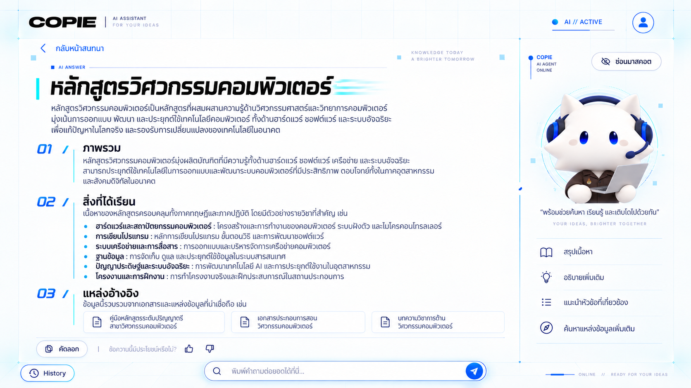

- **`กลับหน้าสนทนา` ด้านบน:** ออกจากโหมดอ่านเต็ม กลับไปผังที่มาสคอตเด่นกลางจอ
- **พื้นที่บทความกว้างทางซ้าย:** แสดงหัวข้อ ย่อหน้า หัวข้อย่อย และรายการให้อ่านต่อเนื่องได้
- **ส่วน `แหล่งอ้างอิง`:** แสดงเอกสารที่ใช้ตอบคำถาม และควรเปิดรายละเอียดแหล่งข้อมูลได้เมื่อมีข้อมูลจริง
- **คัดลอกและให้ Feedback:** ใช้งานกับคำตอบที่กำลังอ่าน
- **มาสคอตในแถบขวา:** ย่อขนาดเพื่อคืนพื้นที่ให้บทความ; ปุ่ม `ซ่อนมาสคอต` ให้ผู้ใช้ขยายพื้นที่อ่านได้อีก
- **ช่องถามต่อด้านล่าง:** สนทนาต่อจากหัวข้อเดิมได้ทันที

**เมื่อทำงานจริง:** โหมดนี้เป็นสถานะการแสดงผลของคำตอบ ไม่จำเป็นต้องเป็นบทสนทนาใหม่ การซ่อนมาสคอตต้องไม่ทำให้เนื้อหาหรือปุ่มสำคัญหายไป

## 06 — เปิดประวัติการสนทนา

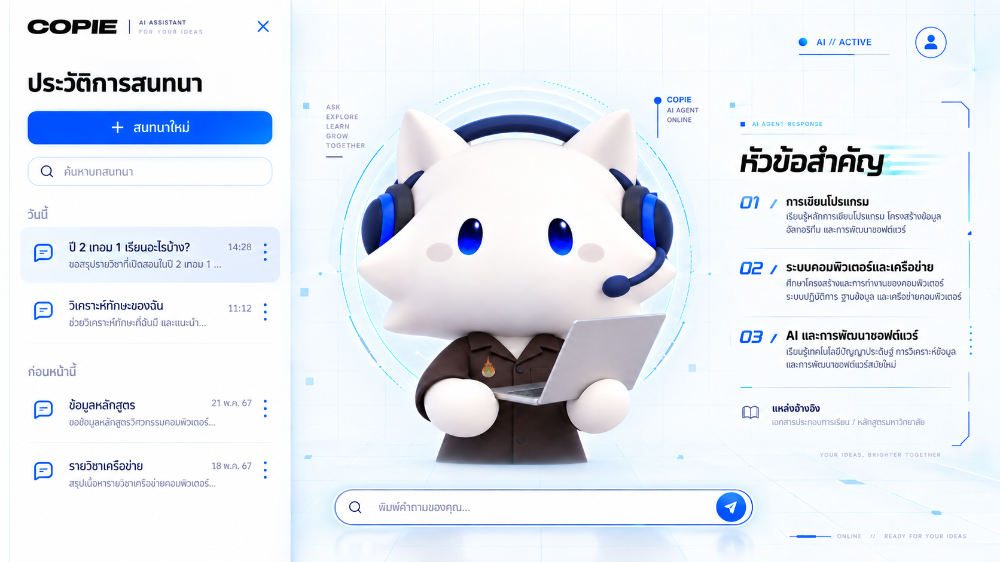

- **แผงซ้ายที่เลื่อนเข้ามา:** พื้นที่ดูและเลือกบทสนทนาเดิม โดยหน้าสนทนายังเห็นอยู่ด้านหลัง
- **ปุ่ม `สนทนาใหม่`:** เริ่มบทสนทนาใหม่
- **ช่องค้นหา:** กรองบทสนทนาจากหัวข้อหรือข้อความ
- **กลุ่ม `วันนี้` และ `ก่อนหน้านี้`:** แบ่งรายการตามเวลาเพื่อให้ค้นง่าย
- **รายการที่ไฮไลต์:** บทสนทนาที่กำลังเปิดอยู่ พร้อมเวลาหรือวันที่
- **ปุ่มปิด `×`:** ปิดแผงและคืนพื้นที่ให้หน้าสนทนา
- **มาสคอตและคำตอบด้านหลัง:** เลื่อนไปอยู่ในพื้นที่ที่เหลือ ไม่ถูกแผงทับแบบอ่านไม่ออก

**เมื่อทำงานจริง:** เลือกรายการแล้วโหลดข้อความเดิมและสนทนาต่อได้ ปุ่มจุดสามจุดของรายการเหมาะสำหรับคำสั่งเฉพาะรายการ เช่น เปลี่ยนชื่อหรือลบเมื่อรองรับ

## 07 — คำตอบแบบตารางรายวิชา

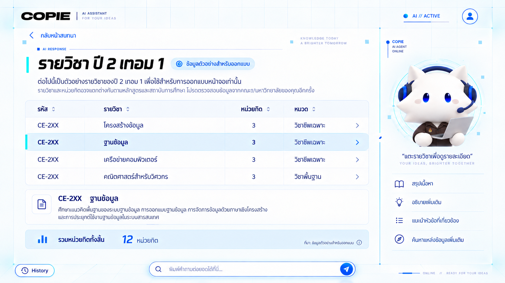

- **ชื่อผลลัพธ์:** ระบุปีและภาคการศึกษาที่ถาม เพื่อไม่ให้ตารางขาดบริบท
- **ป้าย `ข้อมูลตัวอย่างสำหรับออกแบบ`:** ระบุว่ารหัสวิชาและข้อมูลในภาพไม่ใช่ข้อมูลหลักสูตรที่ตรวจสอบแล้ว
- **ตารางหลัก:** คอลัมน์รหัส รายวิชา หน่วยกิต และหมวด รองรับการสแกนข้อมูลจำนวนมาก
- **แถวที่เลือก:** ไฮไลต์แถวและแสดงรายละเอียดรายวิชาด้านล่างตาราง
- **แถวรวมหน่วยกิต:** สรุปค่ารวมของภาคการศึกษาที่แสดง
- **มาสคอตแถบขวา:** เป็นผู้ช่วยประกอบหน้าข้อมูล โดยย่อไม่ให้บังตาราง
- **ช่องถามต่อ:** ใช้ถามรายละเอียดของรายวิชาหรือภาคการศึกษาต่อ

**เมื่อทำงานจริง:** ใช้ข้อมูลจาก Curriculum Tool; รหัสวิชา ชื่อ และหน่วยกิตต้องมาจากข้อมูลจริง ไม่ใช้ค่าตัวอย่างในภาพ

## 08 — คำตอบแบบการ์ดข้อมูล

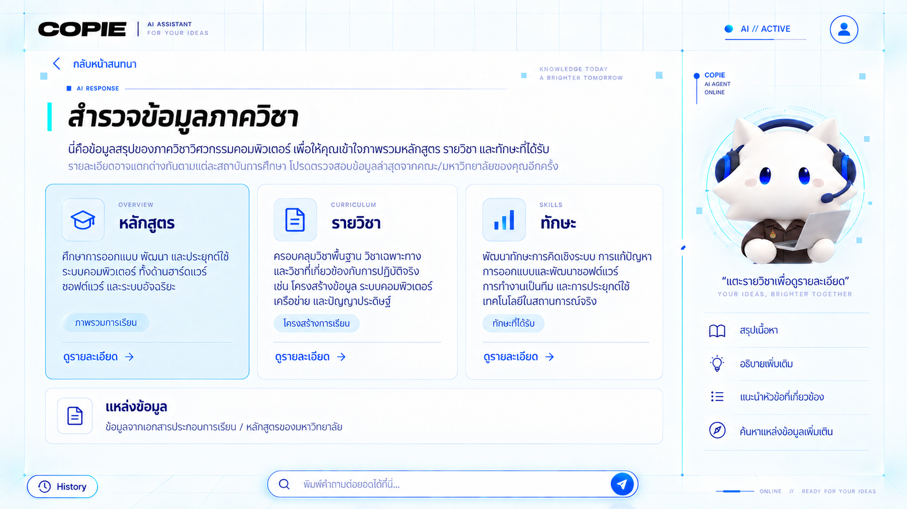

- **หัวข้อคำตอบ:** บอกว่าการ์ดทั้งสามเป็นผลลัพธ์จากคำถามเดียวกัน
- **การ์ด `หลักสูตร`, `รายวิชา`, `ทักษะ`:** แบ่งข้อมูลเป็นหมวดที่เข้าใจง่าย แต่ละการ์ดมีไอคอน คำอธิบายสั้น และปุ่มดูรายละเอียด
- **การ์ดที่มีสีฟ้าอ่อน:** ตัวอย่างสถานะเลือกหรือโฟกัส
- **ส่วนแหล่งข้อมูลด้านล่าง:** บอกว่าคำตอบอ้างอิงข้อมูลประเภทใด
- **มาสคอตด้านขวา:** ย่อขนาดตามกติกาเดียวกับตารางและโหมดอ่าน
- **ช่องถามต่อ:** ถามเจาะลึกจากหมวดที่สนใจได้

**เมื่อทำงานจริง:** การกด `ดูรายละเอียด` ควรเปิดข้อมูลหมวดนั้นหรือส่งคำถามต่อที่สัมพันธ์กับการ์ด ไม่ใช่เพียงเปลี่ยนสีการ์ด

## 09 — ก่อนเริ่ม Skill Assessment

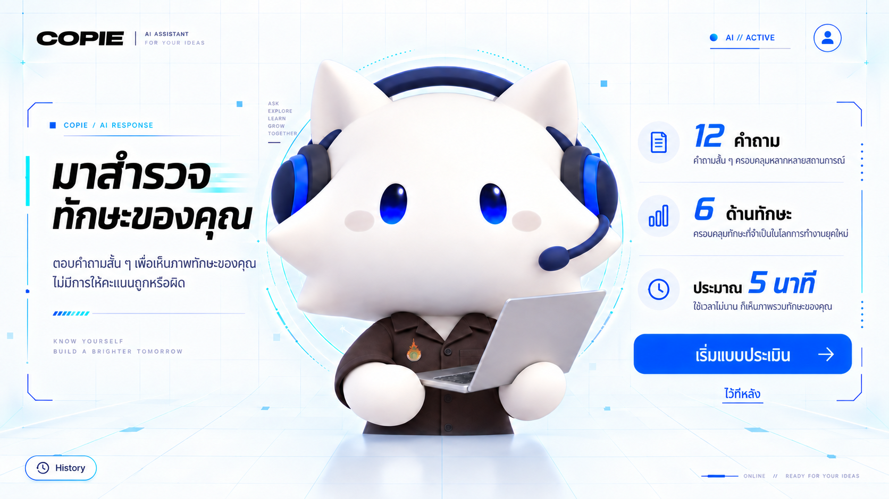

- **ข้อความด้านซ้ายจาก COPIE:** ชวนสำรวจทักษะและย้ำว่าไม่มีคำตอบถูกหรือผิด
- **มาสคอตกลางจอ:** ทำหน้าที่แนะนำขั้นตอนก่อนเริ่ม จึงยังมีขนาดใหญ่
- **ข้อมูลด้านขวา:** บอกขอบเขต `12 คำถาม`, `6 ด้านทักษะ` และเวลาโดยประมาณ
- **ปุ่ม `เริ่มแบบประเมิน`:** ไปยังคำถามข้อแรก
- **`ไว้ทีหลัง`:** กลับไปสนทนาโดยไม่เริ่มประเมิน
- **History และโปรไฟล์:** ยังอยู่ในกรอบหน้าหลักของผู้ใช้ที่เข้าสู่ระบบแล้ว

**เมื่อทำงานจริง:** หน้านี้ปรากฏเมื่อ Agent ต้องการ Skill Profile แต่ยังไม่มีผลประเมินของผู้ใช้ การกด `ไว้ทีหลัง` ไม่ควรสร้างคะแนนทักษะ

## 10 — ตอบแบบประเมินทีละข้อ

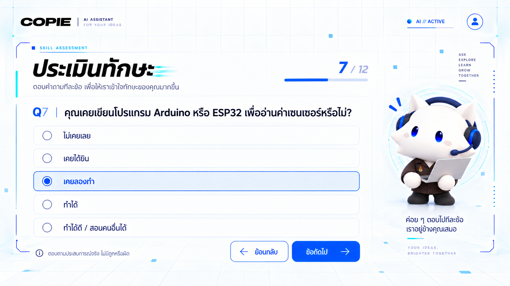

- **หัวข้อและตัวนับ `7 / 12`:** บอกตำแหน่งปัจจุบันในแบบประเมิน
- **แถบความคืบหน้า:** เห็นว่าทำไปแล้วประมาณเท่าไร
- **คำถามหลัก:** แสดงเพียงหนึ่งข้อ ภาพใช้ประสบการณ์ Arduino/ESP32 เป็นตัวอย่าง
- **ตัวเลือก 5 ระดับ:** ปุ่มเลือกได้ค่าเดียว ตั้งแต่ `ไม่เคยเลย` ถึง `ทำได้ดี / สอนคนอื่นได้`
- **ตัวเลือกที่ไฮไลต์:** แสดงคำตอบที่เลือกอยู่ในข้อนี้
- **`ย้อนกลับ` และ `ข้อถัดไป`:** กลับไปแก้คำตอบหรือเดินหน้าต่อ
- **มาสคอตตัวเล็กทางขวา:** ให้กำลังใจโดยไม่แย่งพื้นที่คำถาม

**เมื่อทำงานจริง:** ต้องตอบครบก่อนส่งผล ข้อสุดท้ายเปลี่ยนปุ่มหลักเป็น `ดูผล`; ขณะส่งผลควรป้องกันการกดซ้ำ หน้านี้ซ่อนช่องแชตเพื่อไม่ให้สับสนกับการตอบแบบประเมิน

## 11 — ผล Skill Radar

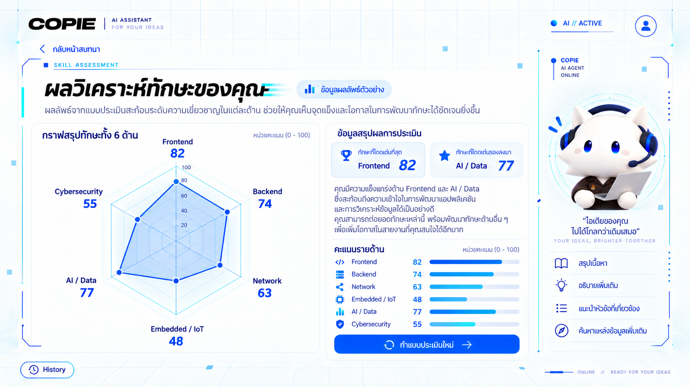

- **หัวข้อและป้ายผลตัวอย่าง:** บอกว่าเป็นผลวิเคราะห์ทักษะ และคะแนนในภาพเป็นข้อมูลประกอบงานออกแบบ
- **กราฟ Radar ทางซ้าย:** เปรียบเทียบ 6 ด้าน ได้แก่ Frontend, Backend, Network, Embedded/IoT, AI/Data และ Cybersecurity บนสเกล 0–100
- **คะแนนตัวเลขข้างกราฟและรายการด้านขวา:** ให้ผู้ใช้เห็นค่าจริงโดยไม่ต้องตีความจากรูปทรงกราฟอย่างเดียว
- **การ์ดทักษะเด่น:** ยกสองด้านที่มีคะแนนสูงสุดขึ้นมาอ่านเร็ว
- **คำอธิบายผล:** สรุปจุดเด่นและแนวทางพัฒนาต่อโดยไม่ตัดสินผู้ใช้
- **ปุ่ม `ทำแบบประเมินใหม่`:** เริ่มรอบใหม่เมื่อผู้ใช้ต้องการ
- **มาสคอตด้านขวา:** ย่อขนาดและแสดงอารมณ์ยินดีกับการทำแบบประเมินสำเร็จ

**เมื่อทำงานจริง:** คะแนนต้องคำนวณจากคำตอบแบบประเมินและบันทึกเป็น Skill Profile; คำอธิบายจาก AI อ้างอิงผลนั้น ไม่สร้างคะแนนเอง

## ลำดับการใช้งานและข้อจำกัดของภาพ

```text
Login → Onboarding (เฉพาะผู้ใช้ใหม่) → พิมพ์คำถาม → AI ตอบ
                                              ├→ อ่านเนื้อหาเต็ม
                                              ├→ เปิด History
                                              ├→ ตารางรายวิชา / การ์ดข้อมูล
                                              └→ เริ่มประเมิน → ตอบ 12 ข้อ → Skill Radar
```

ภาพทุกภาพเป็น mockup แบบนิ่ง ปุ่มและช่องกรอกในภาพยังไม่สามารถกดได้จริง ข้อความ รายวิชา แหล่งอ้างอิง และคะแนนบางส่วนเป็นข้อมูลตัวอย่าง การพัฒนาจริงต้องใช้ข้อมูลจาก API และสัญญาข้อมูลของโปรเจกต์ พร้อมรองรับจอขนาดเล็กและการเข้าถึงด้วยคีย์บอร์ด
